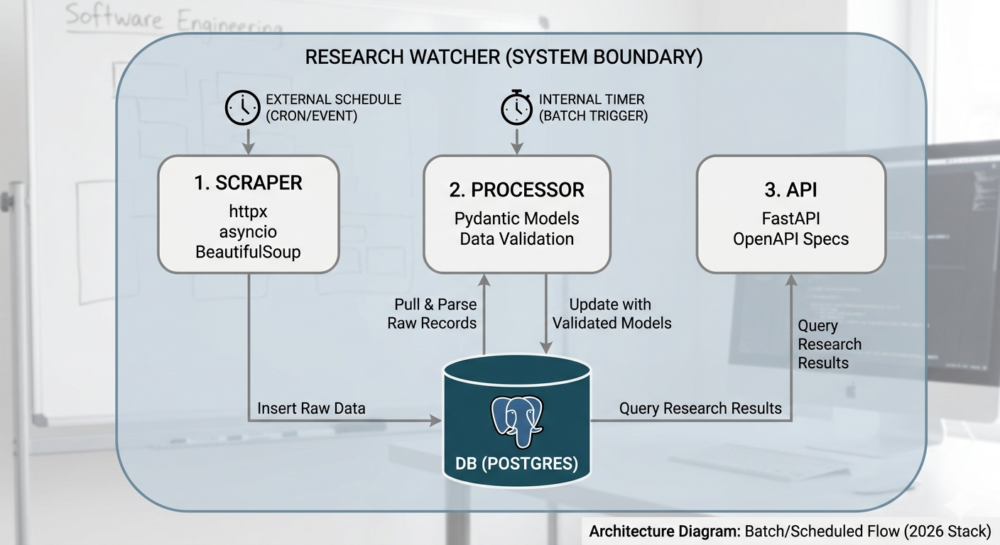
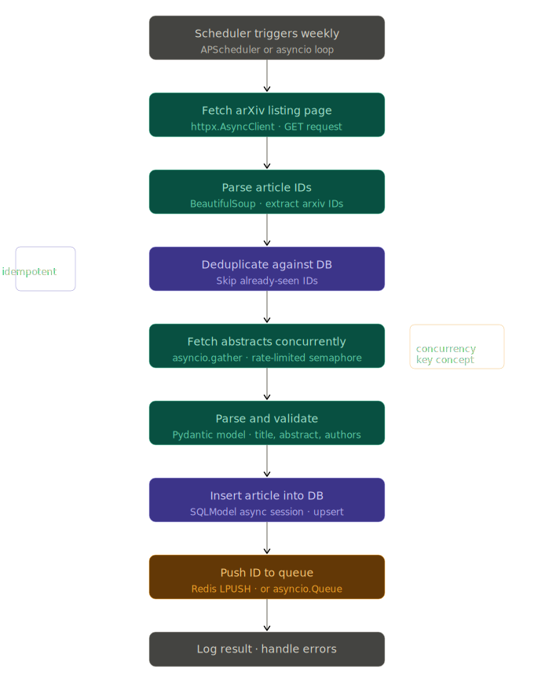
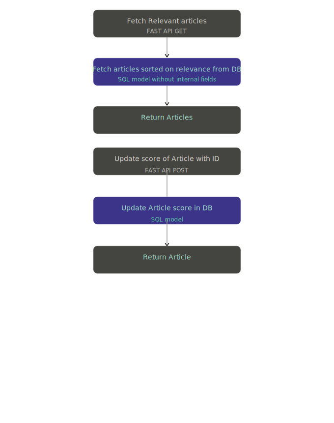

## ArXiv paper filtering system

This application is built to help brush up on Python concepts and also help me keep an eye on the research papers coming out in my area of interest, i.e. 3D Virtual Try On. I intend to build it to update my python skills in async, pydantic and SQLmodel, fastapi etc.

- scraping service that goes through arXiv list for cs.CV topic and finds all article ids every week.  
- Once content of each abstract is got it should be inserted to DB and Id inserted to a queue. 
- Processing service reads from queue - Each article abstract is scraped, keywords tracked, compared with list of given keywords based on direct occurence or similarity and a relevance score is given. Processed article is stored in DB. 
- An API is made available to fetch the most relevant 10 article links in arxiv with the details for the week. Also to give a manual score

### Scraping service

- Scheduled externally for once a week and calls this function
- Collects article ids in the list for the week using the listing url  of arXiv in following format
`baseURL = "https://arxiv.org/list/cs.CV/pastweek?skip={pgNum*pgCt}&show={pgCt}"`
- Asynchronously fetch the article abstracts with a rate limit
- Extract abstract text and title and store in DB

### To run locally

- Install the project based on pyproject.toml
`uv pip install -e .`
- Run the postgres as docker
`docker-compose up -d`
- Run the scraper
`python -m scraper.main`

## Processing service

- Processes the title and text to obtain a summary, get keywords, match against relevance keywords to get a relevance score
- Store the score in DB

## API

- Fetch API to get the articles in the order of relevance
- Provide a manual score to be used in training later on

