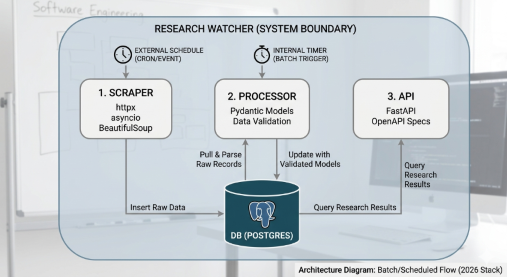
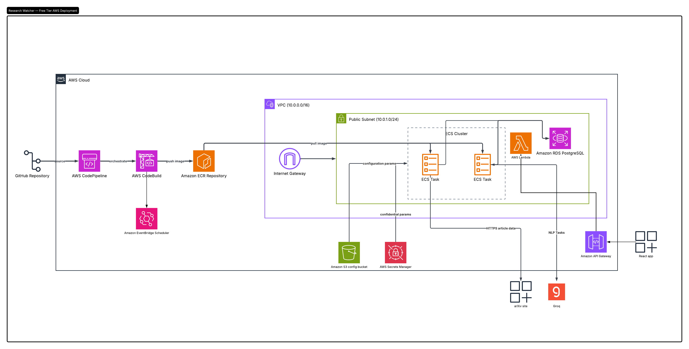
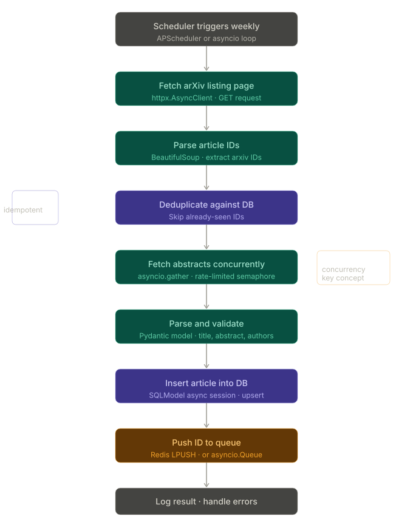
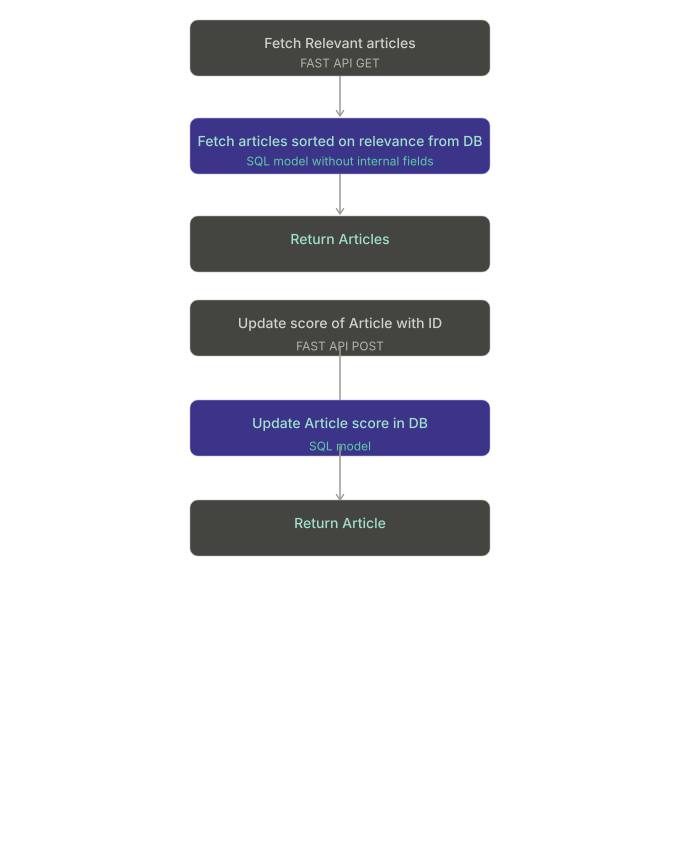

# ArXiv paper filtering system

This application is built to help brush up on Python concepts and also help me keep an eye on the research papers coming out in my area of interest, i.e. 3D Virtual Try On. I intend to build it to update my python skills in async, pydantic and SQLmodel, fastapi etc.






- scraping service that goes through arXiv list for cs.CV topic and finds all article ids every week.  
- Once content of each abstract is got it should be inserted to DB and Id inserted to a queue. 
- Processing service reads from queue - Each article abstract is scraped, keywords tracked, compared with list of given keywords based on direct occurence or similarity and a relevance score is given. Processed article is stored in DB. 
- An API is made available to fetch the most relevant 10 article links in arxiv with the details for the week. Also to give a manual score
- A React web app will fetch the data and show it on the web page based on user preferences


## Deployment Architecture

The project is deployed in AWS within free tier constraints
- Weekly schedule for scraper. Eventbridge triggers ECS task
- Daily schedule for processor. Eventbridge triggers ECS task
- Lambda + API gateway for API
- s3 for React static content
- ECR for containers
- CodeBuild and CodePipeline for automatic deployment



## Local Development


- Install uv the package manager
`curl -LsSf https://astral.sh/uv/install.sh | less`
- Install the project based on pyproject.toml
`uv sync `
- Run the postgres as docker
`docker-compose up -d`
-Create .env file similar to this
```
db_type=postgres
POSTGRES_PASSWORD=PASSWORD
POSTGRES_DB=postgres
db_protocol=postgresql+asyncpg
db_user=postgres
db_host=localhost
llm_api_key=APIKEY
llm_host=https://api.groq.com/openai/v1
db_sslstring=ssl
```

## Scraping service

- Scheduled externally for once a week and calls this function
- Collects article ids in the list for the week using the listing url  of arXiv in following format
`baseURL = "https://arxiv.org/list/cs.CV/pastweek?skip={pgNum*pgCt}&show={pgCt}"`
- Asynchronously fetch the article abstracts with a rate limit
- Extract abstract text and title and store in DB



### To run locally
- Run the test
`uv run pytest tests/scraper`

- Run the scraper
`python -m scraper.main`

## Processing service

- Processes the title and text to obtain a summary, get keywords, match against relevance keywords to get a relevance score
- We will have a plugin architecture where we can either use sentence transformers or HostedLLMs to generate a score based on they keywords.
- If the score is below threhold, we will mark the Article as processed, set status to rejected and save the score
- If the score is above a threshold, we will fetch the text of the paper and extract keywords and summary 
- Store the article with keywords and summary also the new score in DB, status as indexed
- TODO:Store the article in vectorDB for future search



### To run locally

- Run the test
`uv run pytest tests/processor`

- Run the scraper
`python -m processor.main`


## API

- Fetch API to get the articles in the order of relevance/date
- Keyword based search
- TODO: Keyword/phrase based vector search (RAG)
- TODO: Librarian agentic workflow to bring down relevant documents on the topic



### To run locally

```
fastapi dev .\src\api\main.py
```   
## REACT WEB APP

- TODO: App that consumes the API